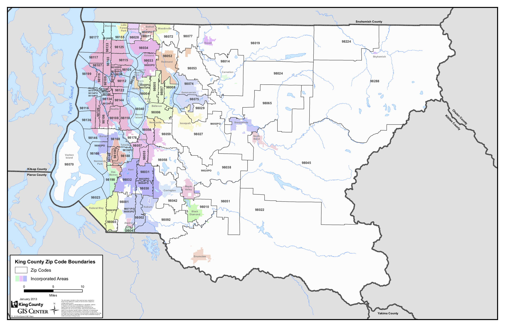
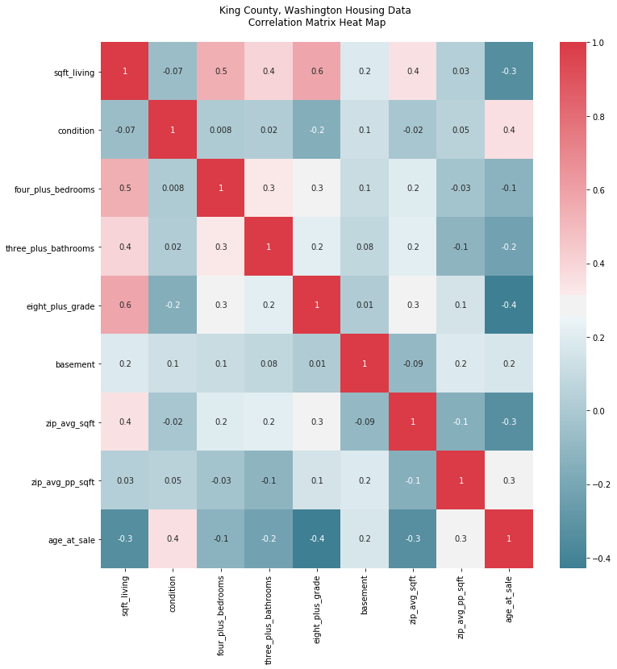

# What Makes a House a Home in King County Washington?
**A Linear Regression Model to Predict the Price of a Home**    
*by Christine Egan*

## Table of Contents
* I. Introduction
* II. Navigating the Repository
* III. Methodology
* IV. Conclusions

## I. Introduction
For this project, I will perform an analysis of the King County housing data set. My objective is to design a linear regression model that will predict the price the of a home in King County, given certain features.

King County is located in the state of Washington in the United States. Washington is a coastal in the Pacific North West, and is part of the greater Seattle area. It is a diverse county, with rural, suburban, and urban areas. The data set included data from 70 different zipcodes.     

   

In this data set, I was provided with the following features:   
* id (a unique identification number for each home)
* date (the date of sale)
* price (the selling price)
* bedrooms (the number of bedrooms)
* bathrooms (the number of bathrooms)
* sqft_living (square footage of the living square)
* sqft_lot (square footage of the lot)
* floors (the number of floors)
* waterfront (indicates if the property was a waterfront property, when available)
* view (indicates the amount of times the home was viewed)
* condition (a scale of 1-5 the indicates how well a home was maintained)
* grade (a scale of 1-13 that indicates the quality of the home, based on...)
* sqft_above (square footage above ground)
* sqft_basement (square footage below ground)
* yr_built (year the home was built)
* yr_renovated (year the home was rennovated)
* zipcode (home location zip code)
* lat (home location latitude)
* long (home location longitude)
* sqft_living15 (square footage of interior housing living space for the nearest 15 neighbors)
* sqft_lot15 (square footage of interior housing lot space for the nearest 15 neighbors)   

If you are interested in how King County determines the grade and condition of the property, take a look at page 33 this guide: <https://www.kingcounty.gov/depts/assessor/Reports/area-reports/2017/residential-westcentral/~/media/depts/assessor/documents/AreaReports/2017/Residential/013.ashx>      

## II. Navigating the Repo

| Filename        | Description   |
| :-------------  |:--------------|
| README.md       | a .md file that is a guide to this repository, the current document           |
| model.ipynb     | a jupyter notebook containg the model, and technical details used to create it|
| my_function.py  | a .py file with collection of custom functions used in model.ipynb            |
| my_functions.md | a .md file with a description of the custom functions in my_functions.py      |
| presentation.pdf| a .pdf file of the non-technical overview of this project                     |
| kc_zip_map.png  | a .png file with an image of King County zip code boundary map                |

## III. Methodology
For this anaylsis, the OSEMN methodology was used. For the purposes of this document, scrubbing data and exploring data were combined into one section.

### 1. Obtaining Data
The original dataset can be found at: <https://raw.githubusercontent.com/learn-co-students/dsc-mod-2-project-v2-1-onl01-dtsc-pt-052620/master/kc_house_data.csv>.     

### 2. Scrubbing & Exploring Data
From the original data, certain features were retained, modified, added, and removed.

#### Retained / Transformed
| Feature    | Description of Action |
|:---------  | :-----------|
|id          | Some id numbers appeared twice, with different date values, indicating the same home being sold more than once in the same two year period. Duplicate id entries were removed, keeping the first sale.|
|date        | Transformed to datetime object from a string. |
|price       | Outliers with a z-score greater than 3 were removed.|
|sqft_living | Full retained. |      

#### Modified
| Feature     | Description of Action |
|:---------   | :-----------|
|bedrooms     | Outliers with z-score greater than 3 were removed. Then, it was used to create the feature '4_plus_bedrooms', which contained 0 or 1 to indicate if there were more or less than 4 bedrooms. |
|bathrooms    | Outliers with z-score greater than 3 were removed. Then, it was used to create the feature '3_plus_bathrooms', which contained 0 or 1 to indicate if there were more or less than 3 bathrooms. |
|grade        | It was used to create the feature '8_plus_grade', which contained a 0 or 1 to indicate if the grade was more or less than 8. 
|sqft_basement| Because properties without a basement were represented by zero square feet, it created an exetreme left skew. To remedy, it was transformed into the feature 'basement' with a 0 or 1 to indicate the absence or presence of a basement.|
|yr_built     | Transformed to create 'age_at_sale' using 'date'.
|zipcode      | Transformed to create the features 'zip_avg_price', 'zip_avg_sqft', 'zip_avg_pp_sqft' using 'price.' |
|sqft_living  | Combined with 'price' to create 'price_per_sqft'. |     

#### Created
| Feature     | Description of Feature |     
|:---------   | :-----------|
| 4_plus_bedrooms  | Indicates with a 0 or 1 if there are more than 4 bedrooms. |
| 3_plus_bathrooms | Indicates with a 0 or 1 if there are more than 3 bathrooms. |
| 8_plus_grade     | Indicates with a 0 or 1 if the grade is greater than 8. |
| basement         | Indicates with a 0 or 1 if the presence of a basement. |
| age_at_sale      | Indicates the age of a property on the date of sale. |
| zip_avg_price    | Indicates the average price for a property by zipcode. |
| zip_avg_sqft     | Indicates the average of 'sqft_living' per zipcode. |
| zip_avg_pp_sqft  | Indicates the average price per square foot per zipcode. |        

#### Eliminated
| Feature     | Reason for Elimination |
|:---------   | :-----------|
| yr_renovated | There was a lot of missing data, making it an unsuitable predictor. |
| floors       | This information was redundant, and similar information could be obtained by examining square footage and number of rooms. |
| waterfront   | There was a lot of missing data, making it an unsuitable predictor. |
| view         | There was a lot of missing data, making it an unsuitable predictor. |
| lat          | Not needed for this analysis. |
| long         | Not needed for this analysis |
| sqft_above   | This information was redundant, and similar information could be obtained by examining square footage and number of rooms. |
| sqft_basement| The skew of this information was severe, so it was used to create a more useful feature, then dropped. |
| sqft_lot     | Exetreme outliers made this data fairly unreliable, and efforts to normalize compromised the accuracy of the results. |
| sqft_living15| Demonstrated high correlation with more useful square foot metrics, such as 'sqft_living'.
| sqft_lot15   | The elimination of other features made it irrelevant for analysis.     

#### Final Features
The objective of this model was to test which features have a significant influence on the price of a home in King County. To facilitate this, features were chosen to reflect, the size of the home, the age of the home, the quality of the home, and the location of the home.  

| Feature                | Indicates:                                 |
|:---------              | :-----------                               |
| sqft_living            |  size                                      |
| price_per_sqft_living  |  a relationship between size and price     |
| zip_avg_price          |  a relationship between location and price |
| zip_avg_sqft           |  a relationship between size and location  |
| age_at_sale            |  age                                       |
| zip_age_avg_price      |  a relationship between age and price      |
| 4_plus_bedrooms        |  size                                      |
| 3_plus_bathrooms       |  size                                      |
| 8_plus_grade           |  quality                                   |
| basement               |  size                                      |   

#### Collinearity Check
The final features were tested for multicollinearity using a correlation matrix and heatmap.

## 3. Modeling Data & Interpreting Data
Finally, the resulting data frame was trained and tested with an 70/30 split using OLS statsmodels. This generated the following summary.

### i. The Comprehensive Model

### ii. The Zipcode Group Model

### iii. Modeling by Zipcode Group

#### Zipcode Group One: Price Per Squarefoot Average per Zipcode < $134

#### Zipcode Group One: Price Per Squarefoot Average per Zipcode > $134, < $171

#### Zipcode Group One: Price Per Squarefoot Average per Zipcode < $171, < $210

#### Zipcode Group One: Price Per Squarefoot Average per Zipcode < $210, < $518

## IV. Conclusions
### Final Thoughts
With respect to R-Squared/Adjusted R-Squared values, the Comprehensive Model performed the best. However, since the zipcode average price per square foot was not segmented into groups, it was hard to discern the relationship between the actual zipcode average and the price for a house.

On the other hand, in the Zipcode Group Model, had a lower R-Squared/Adjusted R-Squared values, but provided some interesting information regarding how each price per square foot average by zipcode quantile interacted with price.

The models that addressed each zip code group individually had mixed results: 

### Future Work
I think that this analysis could be improved if population data were included in for each zipcode. It is unclear what effect population might have on price. For example, a zipcode that skews more affluent might have a lower population, however the affluent quality of the neighborhood has a more significant increase on price. There is also an argument to be made that in more crowded areas, the price per square foot might be higher as well.  It is possible that using median incomes in addition to population might reveal more about the role population.

In addition in order to expand on the role of location, I think that the lattitude and longitude data would be a useful feature to explore the proximity between a home and Seattle. One hypothesis is that there is an association between income, population, and proximity to Seattle that would influence what a buyer would be willing to pay for a house.

It might also be interesting to see how fluctuations in population and incomes might predict how housing prices might rise or fall over time.
