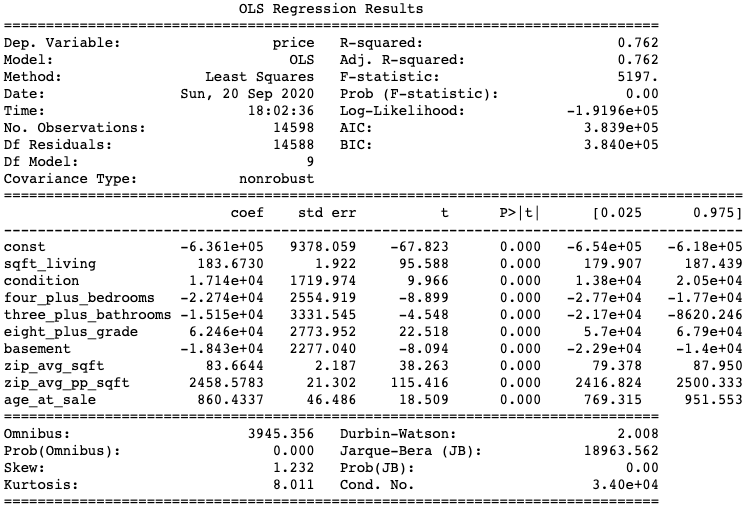
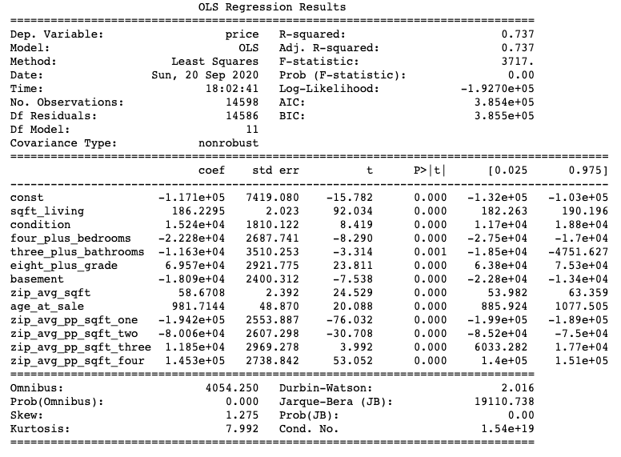
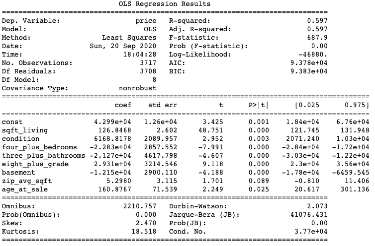
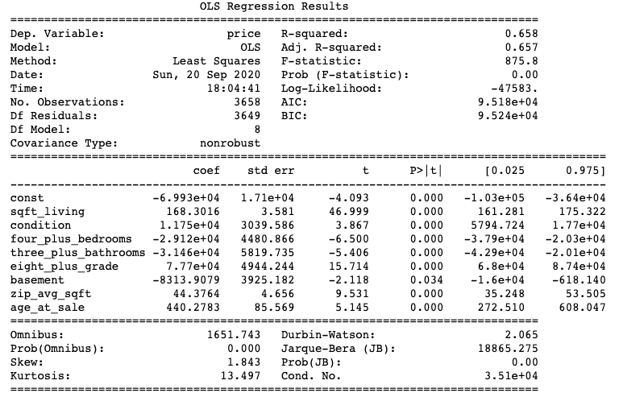
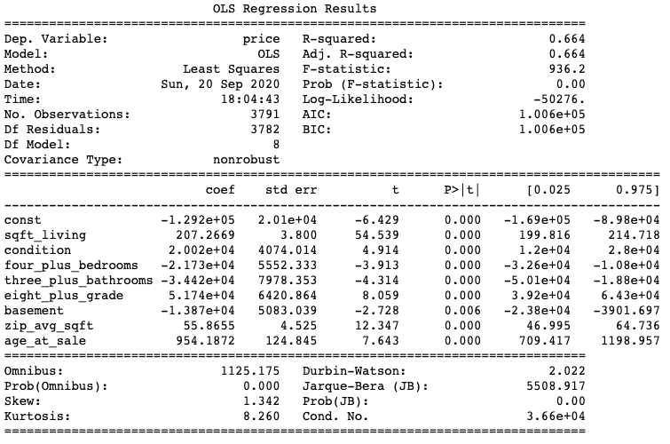

# What Makes a House a Home in King County Washington?
**A Linear Regression Model to Predict the Price of a Home**    

## Table of Contents
* I. Introduction
* II. Navigating the Repository
* III. Methodology
* IV. Conclusions

## I. Introduction
For this project, I will perform an analysis of the King County housing data set. My objective is to design a linear regression model that will predict the price the of a home in King County, given certain features.

King County is located in the state of Washington in the United States. Washington is a coastal in the Pacific North West, and is part of the greater Seattle area. It is a diverse county, with rural, suburban, and urban areas. The data set included data from 70 different zipcodes.     

   

In this data set, I was provided with the following features:   
* id (a unique identification number for each home)
* date (the date of sale)
* price (the selling price)
* bedrooms (the number of bedrooms)
* bathrooms (the number of bathrooms)
* sqft_living (square footage of the living square)
* sqft_lot (square footage of the lot)
* floors (the number of floors)
* waterfront (indicates if the property was a waterfront property, when available)
* view (indicates the amount of times the home was viewed)
* condition (a scale of 1-5 the indicates how well a home was maintained)
* grade (a scale of 1-13 that indicates the quality of the home, based on...)
* sqft_above (square footage above ground)
* sqft_basement (square footage below ground)
* yr_built (year the home was built)
* yr_renovated (year the home was rennovated)
* zipcode (home location zip code)
* lat (home location latitude)
* long (home location longitude)
* sqft_living15 (square footage of interior housing living space for the nearest 15 neighbors)
* sqft_lot15 (square footage of interior housing lot space for the nearest 15 neighbors)   

If you are interested in how King County determines the grade and condition of the property, take a look at page 33 this guide: <https://www.kingcounty.gov/depts/assessor/Reports/area-reports/2017/residential-westcentral/~/media/depts/assessor/documents/AreaReports/2017/Residential/013.ashx>      

## II. Navigating the Repo

| Filename        | Description   |
| :-------------  |:--------------|
| README.md       | a .md file that is a guide to this repository, the current document           |
| model.ipynb     | a jupyter notebook containg the model, and technical details used to create it|
| my_function.py  | a .py file with collection of custom functions used in model.ipynb            |
| presentation.pdf| a .pdf file of the non-technical overview of this project                     |
| kc_zip_map.png  | a .png file with an image of King County zip code boundary map                |

## III. Methodology
For this anaylsis, the OSEMN methodology was used. For the purposes of this document, scrubbing data and exploring data were combined into one section.

### Hypothesis
The price of a house in King County can be predicted using data from four distinct categories, listed from greatest influence to least influence:     
**a. Location**     
The zipcode where a home is located is the primary factor that determines the price of a home.   

**b. Size**   
The size of a home, as its' size relative to other homes in the same zipcode contributes to the price of the home. In additon, a home's functionality (the number and kind of rooms it has) are an aspect of size that also contributes to price.    

**c. Quality**   
Factors such as age, grade, and condition play some role.    

### 1. Obtaining Data
The original dataset can be found at: <https://raw.githubusercontent.com/learn-co-students/dsc-mod-2-project-v2-1-onl01-dtsc-pt-052620/master/kc_house_data.csv>.     

### 2. Scrubbing & Exploring Data
From the original data, certain features were retained, modified, added, and removed.

#### Retained / Transformed
| Feature    | Description of Action |
|:---------  | :-----------|
|id          | Some id numbers appeared twice, with different date values, indicating the same home being sold more than once in the same two year period. Duplicate id entries were removed, keeping the first sale.|
|date        | Transformed to datetime object from a string. |
|price       | Outliers with a z-score greater than 3 were removed.|
|sqft_living | Full retained. |      

#### Modified
| Feature     | Description of Action |
|:---------   | :-----------|
|bedrooms     | Outliers with z-score greater than 3 were removed. Then, it was used to create the feature '4_plus_bedrooms', which contained 0 or 1 to indicate if there were more or less than 4 bedrooms. |
|bathrooms    | Outliers with z-score greater than 3 were removed. Then, it was used to create the feature '3_plus_bathrooms', which contained 0 or 1 to indicate if there were more or less than 3 bathrooms. |
|grade        | It was used to create the feature '8_plus_grade', which contained a 0 or 1 to indicate if the grade was more or less than 8. 
|sqft_basement| Because properties without a basement were represented by zero square feet, it created an exetreme left skew. To remedy, it was transformed into the feature 'basement' with a 0 or 1 to indicate the absence or presence of a basement.|
|yr_built     | Transformed to create 'age_at_sale' using 'date'.
|zipcode      | Transformed to create the features 'zip_avg_price', 'zip_avg_sqft', 'zip_avg_pp_sqft' using 'price.' |
|sqft_living  | Combined with 'price' to create 'price_per_sqft'. |     

#### Created
| Feature     | Description of Feature |     
|:---------   | :-----------|
| 4_plus_bedrooms  | Indicates with a 0 or 1 if there are more than 4 bedrooms. |
| 3_plus_bathrooms | Indicates with a 0 or 1 if there are more than 3 bathrooms. |
| 8_plus_grade     | Indicates with a 0 or 1 if the grade is greater than 8. |
| basement         | Indicates with a 0 or 1 if the presence of a basement. |
| age_at_sale      | Indicates the age of a property on the date of sale. |
| price_per_sqft_living  | Indicates a relationship between size and price, used to obtain averages.|
| zip_avg_price    | Indicates the average price for a property by zipcode. |
| zip_avg_sqft     | Indicates the average of 'sqft_living' per zipcode. |
| zip_avg_pp_sqft  | Indicates the average price per square foot per zipcode. |        

#### Eliminated
| Feature     | Reason for Elimination |
|:---------   | :-----------|
| yr_renovated | There was a lot of missing data, making it an unsuitable predictor. |
| floors       | This information was redundant, and similar information could be obtained by examining square footage and number of rooms. |
| waterfront   | There was a lot of missing data, making it an unsuitable predictor. |
| view         | There was a lot of missing data, making it an unsuitable predictor. |
| lat          | Not needed for this analysis. |
| long         | Not needed for this analysis |
| sqft_above   | This information was redundant, and similar information could be obtained by examining square footage and number of rooms. |
| sqft_basement| The skew of this information was severe, so it was used to create a more useful feature, then dropped. |
| sqft_lot     | Exetreme outliers made this data fairly unreliable, and efforts to normalize compromised the accuracy of the results. |
| sqft_living15| Demonstrated high correlation with more useful square foot metrics, such as 'sqft_living'.
| sqft_lot15   | The elimination of other features made it irrelevant for analysis.     
| price_per_sqft_living  | While this feature was created to obtain averages by zipcode, it is not a suitable predictor because price is needed to calculate price per square foot. As a result, allowing this feature to leak into the testing data set would be essentially the same as including the price column.|

#### Final Features
The objective of this model was to test which features have a significant influence on the price of a home in King County. To facilitate this, features were chosen to reflect, the size of the home, the age of the home, the quality of the home, and the location of the home.  

| Feature                | Indicates:                                 |
|:---------              | :-----------                               |
| sqft_living            |  size                                      |
| zip_avg_price          |  a relationship between location and price |
| zip_avg_sqft           |  a relationship between size and location  |
| age_at_sale            |  age                                       |
| zip_age_avg_price      |  a relationship between age and price      |
| 4_plus_bedrooms        |  size                                      |
| 3_plus_bathrooms       |  size                                      |
| 8_plus_grade           |  quality                                   |
| basement               |  size                                      |   

#### Collinearity Check
The final features were tested for multicollinearity using a correlation matrix and heatmap.

## 3. Modeling Data & Interpreting Data
Finally, the resulting data frame was trained and tested with an 70/30 split using OLS statsmodels. Below, are the summary results for three different approaches.

### i. The Comprehensive Model

In this model, the zipcode groups were not seperated by quartile, and the average price per square foot for that zipcode appeared in each row. 
The R-Squared/Adjusted R-Squared were identical (7.62) which indicates that the model was fairly accurate at predicting price with these features in place. 

#### Testing the Hypothesis
**Location:** Based on both the t-value (>115), p-value (0.0), and the coefficient value, the average price per square foot in a given zip code seems to be the most important determining factor in this model. According to the coefficient, an increase in of 1 the zip average price per square foot is associated with nearly a $2500 increase. For houses in above average zip codes, increases in square footage can lead to huge increases in price. In addition, the average square footage per zip code also had an impact. This impact is less severe in zipcodes with smaller homes on average, however in neighborhoods with larger homes, the influence increases. 

**Size:** The features that measured the association between size and price seem to indicate that size is an important factor. The model predicts that on average in King County, there is an increase of $183 per square foot. When considering smaller homes in less expensive areas, a $183 increase is less consquential. However, for homes in areas that are more expensive than average, or larger homes this can lead to a very large increase. The t-value for this feature is rather high (>95) with a low p-value, indicating that this is an important factor. 

There is also some indication from this model that size with respect to functionality carries some importance. Having more than four bedrooms, a basement, or more than three bathrooms created an average decrease in price larger than $23,000. The t-values for these features are smaller than for 'sqft_living', but they still are not close to zero. In addition, the p-values are very low. In concert, these three factors seem to have a strong influence.

Based on information gleaned from both location and size, it appears that location and size seem to work together.

**Quality:** Grade, condition, and age all seem to contribute to the price of a home. With respect to grade, prices for homes in King County seem to increase by over $62,000 on average when the grade is above 8. Similarly, a higher number in the condition category also indicates a non-trivial increase in price (> $17,000 on average). Finally, the age of a home also seems to play a huge role (average increase of $860 per year of age), especially considering that the oldest home in the data set is 115 years old! T-values well above zero and low p-values also seem to indicate that these features matter. 

**Based on the data and OLS summary from this model, we can reject the null hypothesis that location, size, and quality do not have an association with sale price in King County.**    

### ii. The Zipcode Group Model

In this model, the zipcodes were clustered into groups, based on their average price per square foot. The groups were determined by quartile. This split was intended to provide more information about the degree of influence of average price per square foot for homes in each range.

The R-Squared/Adjusted R-Squared were identical (.737) which indicates that the model was fairly accurate at predicting price with these features in place. 

#### Testing the Hypothesis
**Location:** Homes that appeared in groups 1 and 2 saw the largest negative influence on sale price. On average, sale prices for homes in zip code group 1 fell >$194k below the median ($171K). In group 2, the average drop in price from the median was >$80k. In group 3, there was a modest increase in price of approximately $12K above the median, while homes in group 4 had an average increase of $145K above the median. 
In comparison to the Comprehensive Model, average square footage per zip code seemed to have a less pronounced impact (an average of $58 per square foot increase). Based on the t-values (-76, -30, 3, 53) and p-values (0.0), it seems clear that the impact is statistically significant. However, this becomes slightly more uncertain when considering group 3, as the t-value is much closer to zero than in the other groups. 

**Size:** The coefficient for square feet seems to be very similar to the one obtained in a Comprehensive Model, with a similary high t-value and low p-value, indicating its statistical significance. There is also some indication that more than four bedrooms, three bathrooms, or the presence of a basement has a negative impact on the sale price. Again, in this model we see that the impact of each feature seperately doesn't have a huge impact, however they are still in the range of statistical significance. Since the t-values are slightly lower than in the Comprehensive Model, some of the impact may be being absorbed by the zipcode group. In other words, the negative impact of too many rooms is less pronounced in zipcodes that have a higher price per square foot.

**Quality:** Grade, condition, and age all still seem to contribute to the price of a home. We see a slight dip in the coefficient for condition in this model, however there is still a fairly large increase in price for homes with better scores in condition. Looking at the coefficient, grade seems to have an increased impact in comparison to the Comprehensive Model. Finally, we see an about 7% increase in the average price increase per year of a home's age. 

**Based on the data and OLS summary from this model, we can reject the null hypothesis that location, size, and quality do not have an association with sale price in King County.**    

### iii. Modeling by Zipcode Group

#### Zipcode Group One: Price Per Squarefoot Average per Zipcode < $134
Out of all the of the groups, the model was the least effective at predicting prices within this group. According to the P-Values, we cannot reject the null hypothesis with respect zipcode average price per square foot. This is a departure from the other models, where this was an important factor.    

#### Zipcode Group Two: Price Per Squarefoot Average per Zipcode >$134, < $171
The model was much better at predicting price than in Zipcode Group 1. However, it did not perform as well as The Comprehensive Model, or the Zip Code Group Model.    

#### Zipcode Group Three: Price Per Squarefoot Average per Zipcode  >$171, <$210
Out of all the zipcode groups, the model performed best when predicting for Zipcode Group 3, with Zipcode Group 2 as a close second. This is somewhat predictable because they are both in close proximity to the mean.    

#### Zipcode Group Four: Price Per Squarefoot Average per Zipcode  >$210, <$518
The model predicted Zip Group 4 fairly well. However, it is clear that the null hypothesis with respect to the number of bedrooms cannot be rejected when predicing home prices for Zipcode Group 4.     

#### Overall Impressions
As mentioned above, the model seemed to perform the best when predicting within Zipcode Groups 2 and 3. This is most likely due to their proximity to the median price. On the other hand, we can see in Groups 3 and 4, that graphs of the residuals appear more normal and less skewed than groups 1 and 2. 

## IV. Conclusions
### Final Thoughts
Location seems to be the leading factor that determines the price of a home in King County Washington. However, the ability for the model to predict price relies on the other factors to refine the estimates. 

When it comes to size, there are a cluster of different factors that work together to describe not only the quantity of space, but how much of that space is functional. We see that for two properties, if the square footage of living space is the same, but one contains a basement, we know that is less desirable space, which will decrease the value of the home. Too many bedrooms in a house with below average square feet, is a sign of less functional smaller bedrooms. 

When we consider that grade speaks to the quality of the structure, or the 'bones.' Buidings that are said to have 'good bones' retain their value on the market, and can even increase in value if they age gracefully. This ties into condition, as it is resultant on updates and modifications made to the structure. When homes are well built and well maintained, their age becomes an asset. 

With respect to R-Squared/Adjusted R-Squared values, the Comprehensive Model performed the best. However, since the zipcode average price per square foot was not segmented into groups, it was hard to discern the relationship between the actual zipcode average and the price for a house.
On the other hand, in the Zipcode Group Model, had a lower R-Squared/Adjusted R-Squared values, but provided some interesting information regarding how each price per square foot average by zipcode quantile interacted with price.

The models that addressed each zip code group individually had mixed results. 

### Future Work
I think that this analysis could be improved if population data were included in for each zipcode. It is unclear what effect population might have on price. For example, a zipcode that skews more affluent might have a lower population, however the affluent quality of the neighborhood has a more significant increase on price. There is also an argument to be made that in more crowded areas, the price per square foot might be higher as well.  It is possible that using median incomes in addition to population might reveal more about the role population.

In addition in order to expand on the role of location, I think that the lattitude and longitude data would be a useful feature to explore the proximity between a home and Seattle. One hypothesis is that there is an association between income, population, and proximity to Seattle that would influence what a buyer would be willing to pay for a house.

It might also be interesting to see how fluctuations in population and incomes might predict how housing prices might rise or fall over time.
